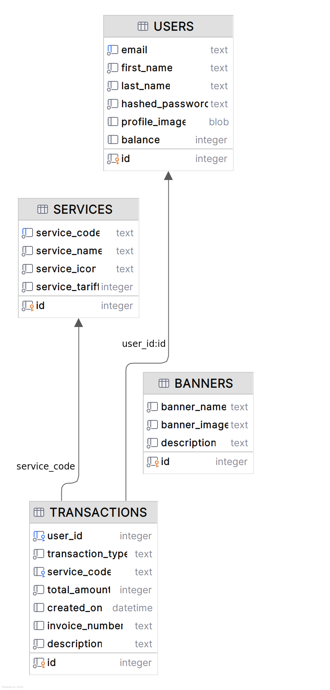

# Dokumentasi Project

## Integrasi Swagger API

Dokumentasi API Swagger dapat diakses melalui [link ini](https://api-doc-tht.nutech-integrasi.com/).

---

## Desain Database

Desain database untuk project ini dapat dilihat pada file [schema.sql](schema.sql) atau melalui diagram berikut:  


---

## Database dan Migrasi

Project ini menggunakan database **SQLite** dan **AtlasGo** untuk declarative versioned migration. Dengan AtlasGo, kita hanya perlu mendefinisikan schema yang diinginkan, dan AtlasGo akan membuat script migrasi secara aman untuk mencapai schema tersebut.

### Langkah Migrasi di Lokal (Linux)

Asumsi: Sistem operasi anda adalah Linux. Dokumentasi untuk Windows/Mac belum tersedia karena pengujian hanya dilakukan di Linux.

1. **Install AtlasGo**  
   ```bash
   curl -sSf https://atlasgo.sh | sh
2. **Apply migrations**

Pastikan nama file SQLite sesuai dengan konfigurasi, defaultnya "nutech.db". Anda dapat memeriksa ENV config beserta defaultnya di file [config.ts](./src/config.ts)
```bash
atlas migrate apply --dir "file://migrations" --url "sqlite://nutech.db"
```

---

## Build dan Menjalankan Project
Project ini menggunakan ES module dan esbuild untuk mem-build aplikasi menjadi satu file. Untuk menjalankan project secara lokal, pastikan Yarn telah terinstal di environment anda.

### Langkah-Langkah

1. **Install dependencies**
```bash
yarn
```
2. **Jalankan dev mode**

Pastikan migrasi database sudah dilakukan sebelumnya. Jika anda pertama kali menjalankan perintah berikut dan terjadi error, hentikan proses dengan `Ctrl + C`, lalu jalankan ulang. Jika tabel `services` dan `banners` kosong, program akan secara otomatis melakukan seed data ke tabel tersebut.
```bash
yarn dev
```
3. **Health Check** 
```sh
curl localhost:4444/health-check
```

---

## Error Handling
Project ini menggunakan global error handler untuk menangani error. Untuk mengirimkan pesan error di luar internal server error, gunakan instance `AppError`.

```ts
export default class AppError extends Error {
  statusCode: StatusCodes;
  isOperational: boolean;
  constructor(
    statusCode: number,
    message: { status: 102 | 103 | 108; message: string },
    isOperational: boolean = true,
    stack: string = '',
  ) {
    super(JSON.stringify(message));
    this.statusCode = statusCode;
    this.isOperational = isOperational;
    if (stack) {
      this.stack = stack;
    } else {
      Error.captureStackTrace(this, this.constructor);
    }
  }
}
```
Setiap error akan melewati middleware `appError`
```ts
export function appError(
  err: Error,
  _: express.Request,
  res: express.Response,
  next: express.NextFunction,
) {
  if (err instanceof AppError) {
    if (!err.isOperational) {
      // gracefully shut down app if it's not an AppError
      db.close();
    }
    console.error(err);
    const errorMessage = JSON.parse(err.message);
    res.status(err.statusCode).json({ ...errorMessage, data: null });
  }
  next();
}
```
---
## Validasi Input
Untuk validasi input saya melakukan improvisasi sehingga pesan error yang di terima oleh pengguna lebih granular, serta lebih mudah jika ingin di proses oleh frontend. Contohnya seperti di bawah ini
```json
{
	"status": 102,
	"message": {
		"email": "Parameter email harus di isi",
		"first_name": "Parameter first_name harus di isi",
		"last_name": "Parameter last_name harus di isi",
		"password": "Parameter password harus di isi"
	},
	"data": null
}
```
Untuk melakukan validasi input saya menggunakan library `zod`. Dengan menggunakan `zod` kita dapat mendefiniskan schema yang kita inginkan beserta dengan pesan errornya di satu instance. Contohnya seperti di bawah ini
```ts
export const membershipRegistrationInputSchema = z.object({
  email: z
    .string({
      required_error: 'Parameter email harus di isi',
      invalid_type_error: 'Parameter email hanya boleh teks',
    })
    .email('Paramter email tidak sesuai format'),
  first_name: z
    .string({
      required_error: 'Parameter first_name harus di isi',
      invalid_type_error: 'Parameter first_name hanya boleh teks',
    })
    .min(1, 'Parameter first_name harus di isi'),
  last_name: z
    .string({
      required_error: 'Parameter last_name harus di isi',
      invalid_type_error: 'Parameter last_name hanya boleh teks',
    })
    .min(1, 'Parameter last_name harus di isi'),
  password: z
    .string({
      required_error: 'Parameter password harus di isi',
      invalid_type_error: 'Parameter password hanya boleh teks',
    })
    .min(8, 'Password length minimal 8 karakter'),
});
```
Setiap input yang masuk akan di validasi oleh middleware ini
```ts
export function validateData(schema: z.ZodObject<any, any>) {
  return (req: Request, res: Response, next: NextFunction) => {
    try {
      schema.parse(req.body);
      next();
    } catch (error) {
      if (error instanceof ZodError) {
        const errorMessages = error.errors.reduce((acc: any, err) => {
          acc[err.path.join('.')] = err.message;
          return acc;
        }, {});
        res.status(StatusCodes.BAD_REQUEST).json({
          status: 102,
          message: errorMessages,
          data: null,
        });
      } else {
        res
          .status(StatusCodes.INTERNAL_SERVER_ERROR)
          .json({ success: false, msg: 'Internal Server Error' });
      }
    }
  };
}
```
___

## Upload Gambar
Gambar yang diunggah oleh pengguna disimpan di SQLite dalam format BLOB. Ketika data profil diambil, gambar dikirimkan dalam bentuk base64, yang dapat di-decode menggunakan [tool](https://www.rapidtables.com/web/tools/base64-to-image.html) ini.

___

## Struktur Project
```
src
├── banner
│   ├── controller.ts
│   ├── repositories.ts
│   └── services.ts
├── membership
│   ├── controller.ts
│   ├── repositories.ts
│   ├── schemas.ts
│   └── services.ts
├── transaction
│   ├── controller.ts
│   ├── repositories.ts
│   ├── schemas.ts
│   └── services.ts
```
1. Schemas: Validasi input (opsional).
2. Repositories: Akses dan manipulasi data.
3. Services: Logika bisnis.
4. Controller: Pemrosesan request dan response.